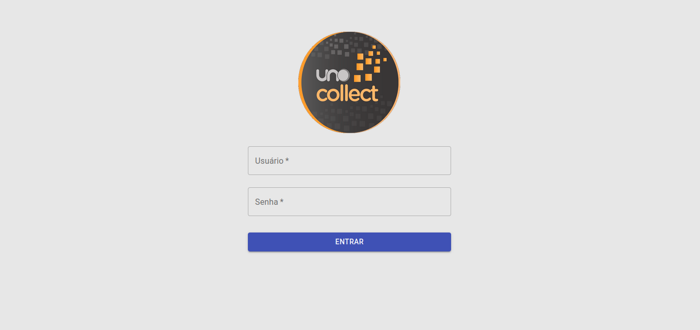
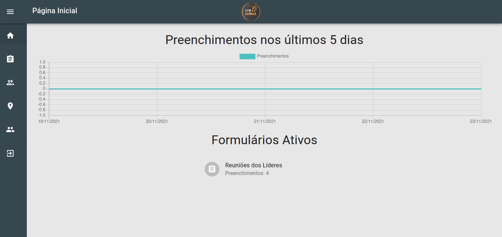
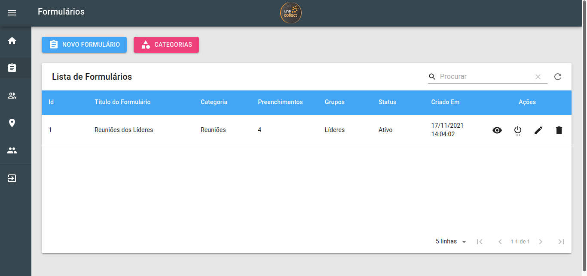
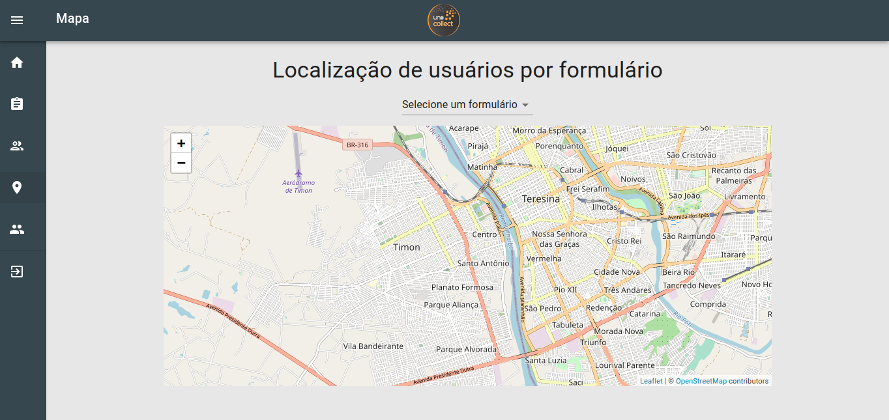
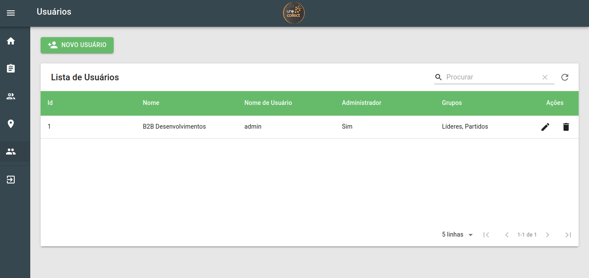

# Uno Collect - Frontend Administrator

## Sobre o Projeto

O aplicativo Uno Collect permite o cadastro de formulários personalizados e a
inserção de respostas por usuários cadastrados.

O projeto atual é um painel administrativo onde somente pessoas credenciadas
podem acessar o sistema.

## Tecnologias e Estrutura
O projeto foi escrito utilizando as seguintes tecnologias:

* Linguagem: [Typescript](https://www.typescriptlang.org/)
* Biblioteca: [ReactJS](https://pt-br.reactjs.org/)
  (inicializado com o [Create React App](https://create-react-app.dev/))
* Biblioteca de Componentes: [Material-UI v4](https://v4.mui.com/pt/)

O projeto foi escrito utilizando o padrão de hooks do react (React Hooks)
utilizando componentes funcionais. Dentre as pastas do projeto, se destacam:

* src: Pasta principal que contém todos os arquivos importantes do projeto.
* src/components: Pasta onde se localizam componentes reutilizáveis.
* src/pages: Pasta que contém as páginas do sistema, definidas no arquivo
  routes. tsx.
* src/services: Pasta que contém os providers utilizados no sistema.
* src/store: Pasta que contém configurações de storage utilizadas pelo Redux.

## Como executar o projeto
### Desenvolvimento
1. Instalar as dependências.
```bash
$ npm i

$ yarn
```

2. Iniciar o projeto
```bash
$ npm run start

$ yarn start
```

3. Após isso o projeto estará pronto para ser utilizado em desenvolvimento.

### Produção
1. Instalar as dependências.
```bash
$ npm i

$ yarn
```

2. Gerar a build de produção
```bash
$ npm run build

$ yarn build
```

3. Iniciar o conteúdo da pasta gerada `build` utilizando algum servidor web.

4. Após isso o projeto estará pronto para ser utilizado em produção.









